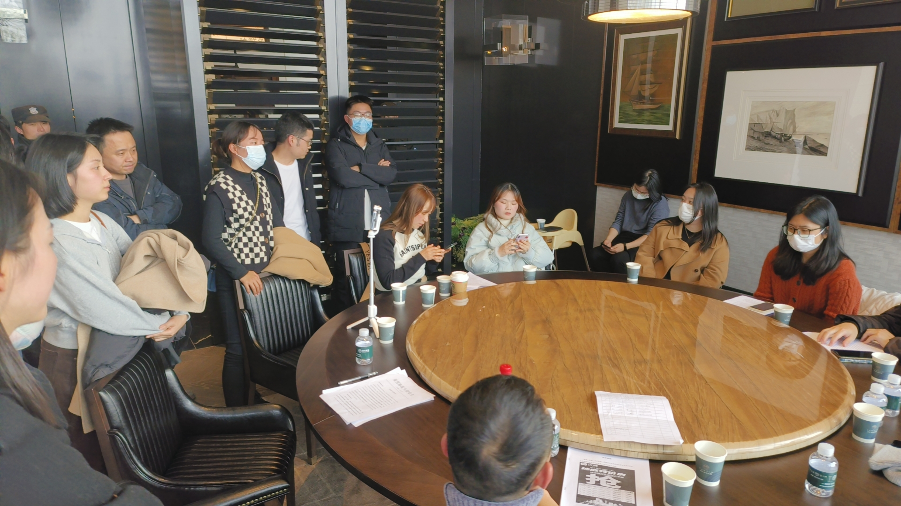
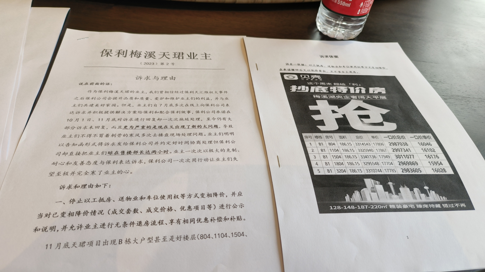
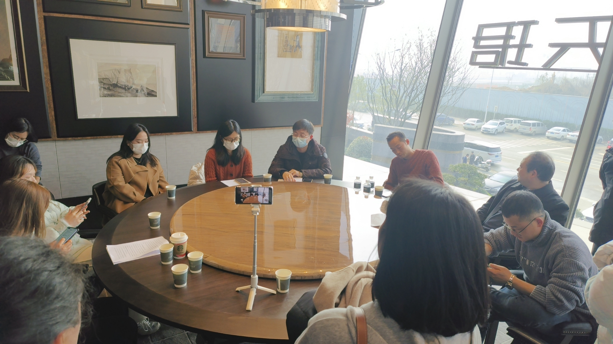
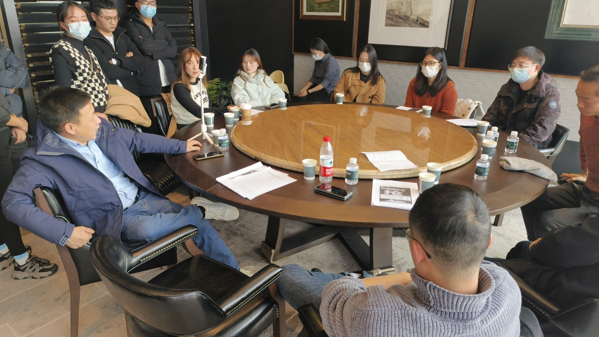
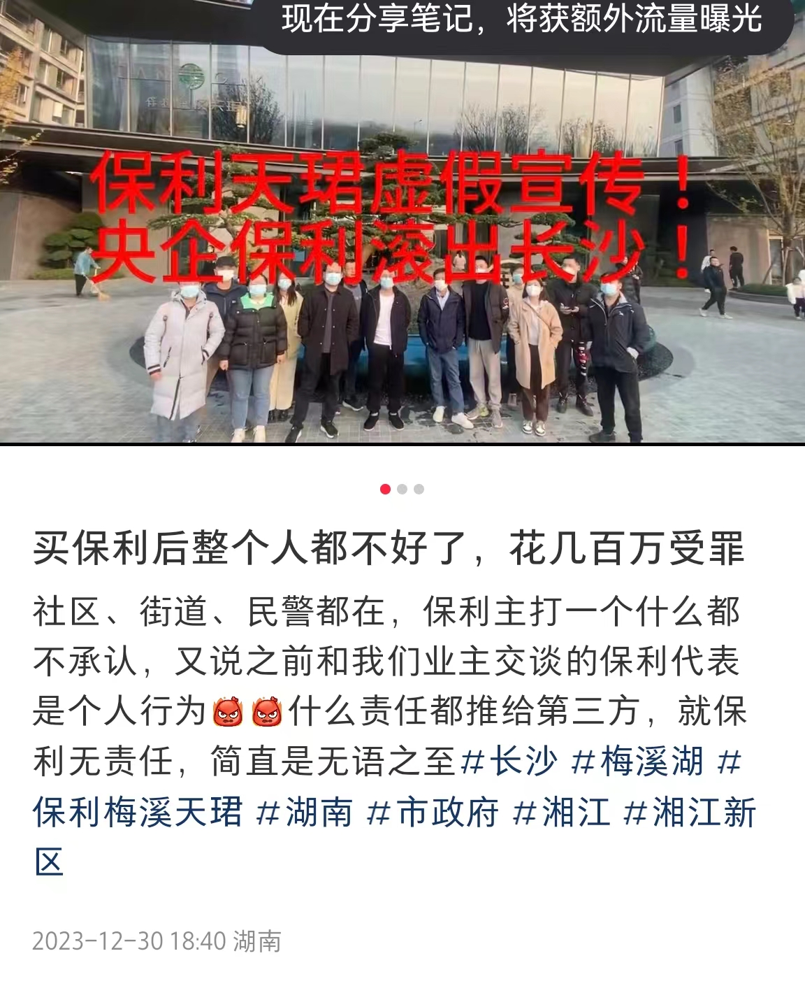

## 现场会议的图片

咱们大概有20名左右的业主到现场和保利所谓的领导进行沟通，在沟通过程中，保利负责人始终秉承置业顾问的宣传话语，前面沟通的油漆问题，都只是个人行为，杨天奥不能代表保利。一切都以合同为准，不在合同范围内的承诺、宣传都是没有任何意义的，保利不认。

<video id="video" controls="" preload="none" poster="封面">
      <source id="mp4" src="./1.mp4" type="video/mp4">
</video>

对于保利没有任何诚意的回复，死猪不怕开水烫的态度，你奈我何的傲慢，请各位邻居引起重视。以后的每一次维权都只会比现在更困难，不要等真正雪崩的时候，才想起来一起对抗，为时晚矣。

